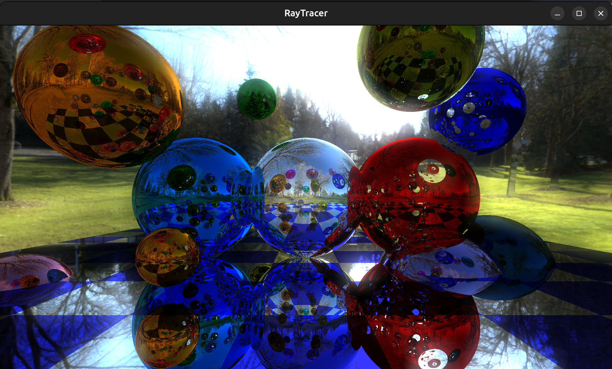

# Raytracer

### Le But
###### Le but du projet Raytracer est de concevoir et de développer un logiciel capable de générer des images en simulant le comportement de la lumière dans une scène tridimensionnelle. Nous devons mettre en œuvre des techniques de rendu telles que le lancer de rayons pour calculer la couleur et l'éclairage de chaque pixel de l'image finale. Cela permet d'explorer des concepts avancés de graphisme et de rendre des scènes réalistes en utilisant des algorithmes sophistiqués.

### Compilation et lancement du programme :
  ```sh
        make re
```
  ```sh
        ./raytracer
```
### Si vous voulez voir le 'Usage' du projet, il vous suffit de faire :
  ```sh
        ./raytracer --help
```
### Voilà un resultat de notre projet (réalisé en 24s):



#### Projet réalisé par :
- **Julien Marcq**
- **Luis Fernandes**
- **Alexis Salaun**
- **Nicolas Nguyen**
